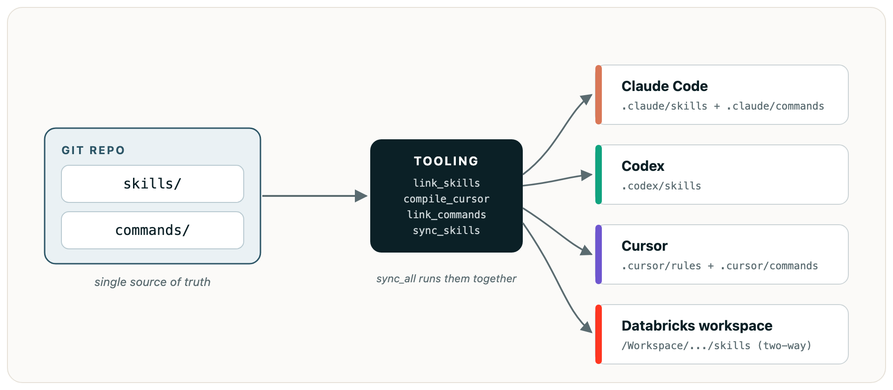

# databricks-skills-template

> Author your agent skills and slash commands **once**, in git — then link, compile, and sync them to **every** agent you use.

<p align="center">
  
</p>

## What this is

Claude Code, Codex, and Cursor each read their skills and slash commands from their own directory, in their own format — and a Databricks workspace wants them somewhere else again. Maintaining the same skill in four places by hand is how they drift apart.

This template keeps **one source of truth** (`skills/` and `commands/` in git) and ships small tools that fan it out to each destination: symlinks for Claude Code and Codex, compiled `.mdc` rules for Cursor, file symlinks for slash commands, and a never-destructive two-way sync for a Databricks workspace. A `harnesses:` tag controls where each skill goes; `sync_all.py` does the whole lot in one command.

Fork or clone it, drop your skills under `skills/`, and you have a private, reviewable, multi-agent skill library.

## Quick start

```bash
# 1. "Use this template" on GitHub (or fork), then clone your repo.
# 2. Create your config:
cp skills-sync.example.toml skills-sync.toml   # edit profile + targets (gitignored)

# 3. Add skills under skills/<name>/ and commands under commands/<name>.md
#    (the included hello-world is a worked example).

# 4. Distribute to every local agent for the current project:
python3 scripts/sync_all.py --dry-run          # preview
python3 scripts/sync_all.py                     # apply
python3 scripts/sync_all.py --include-db        # also sync a Databricks workspace
```

Needs **Python 3.11+**; the workspace sync additionally needs the **Databricks CLI** v0.200+.

## What's included

- **`skills/`** — your skills (`SKILL.md` + optional `scripts/`, `references/`, `assets/`).
- **`commands/`** — single-file `.md` slash commands (`/<name>`).
- **`scripts/`** — `sync_all.py` (everything at once), `link_skills.py` (Claude Code / Codex), `compile_cursor.py` (Cursor rules), `link_commands.py` (slash commands), `sync_skills.py` (Databricks workspace, two-way).
- **`harnesses:` targeting** — tag a skill to send it only where it belongs (e.g. `harnesses: [databricks]`).

## Documentation

- **[docs/usage.md](docs/usage.md)** — setup, per-destination distribution, adding skills/commands, sparse checkout.
- **[docs/harness-targeting.md](docs/harness-targeting.md)** — the `harnesses:` field, per-target allowlists, and `no_pull`.
- **[scripts/README.md](scripts/README.md)** — full tool reference: flags, state model, conflict resolution, recovery.
